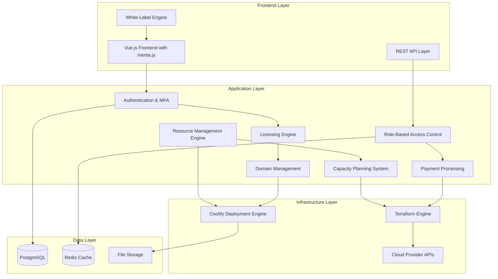

# Design Document

## Overview

This design document outlines the architectural transformation of Coolify into an enterprise-grade cloud deployment and management platform. The enhanced system will maintain Coolify's core strengths in application deployment while adding comprehensive enterprise features including multi-tenant architecture, licensing systems, payment processing, domain management, and advanced cloud provider integration.

### Key Architectural Principles

1. **Preserve Coolify's Core Excellence**: Maintain the robust application deployment engine that makes Coolify powerful
2. **Terraform + Coolify Hybrid**: Use Terraform for infrastructure provisioning, Coolify for application management
3. **Multi-Tenant by Design**: Support hierarchical organizations with proper data isolation
4. **API-First Architecture**: All functionality accessible via well-documented APIs
5. **White-Label Ready**: Complete customization capabilities for resellers
6. **Modern Frontend Stack**: Use Vue.js with Inertia.js for reactive, component-based UI development
7. **Intelligent Resource Management**: Real-time monitoring, capacity planning, and automated resource optimization
8. **Enterprise-Grade Scalability**: Support for high-load multi-tenant environments with predictive scaling

## Architecture

### High-Level System Architecture



### Frontend Architecture

The enterprise platform will use a modern frontend stack built on Vue.js with Inertia.js for seamless server-side rendering and client-side interactivity.

#### Frontend Technology Stack

- **Vue.js 3**: Component-based reactive frontend framework
- **Inertia.js**: Modern monolith approach connecting Laravel backend with Vue.js frontend
- **Tailwind CSS**: Utility-first CSS framework for consistent styling
- **Vite**: Fast build tool and development server
- **TypeScript**: Type-safe JavaScript for better development experience

#### Component Architecture

```
Frontend Components/
├── Organization/
│   ├── OrganizationManager.vue
│   ├── OrganizationHierarchy.vue
│   └── OrganizationSwitcher.vue
├── License/
│   ├── LicenseManager.vue
│   ├── LicenseStatus.vue
│   └── UsageDashboard.vue
├── Infrastructure/
│   ├── TerraformManager.vue
│   ├── CloudProviderCredentials.vue
│   └── ProvisioningProgress.vue
├── Payment/
│   ├── PaymentManager.vue
│   ├── BillingDashboard.vue
│   └── SubscriptionManager.vue
├── Domain/
│   ├── DomainManager.vue
│   ├── DNSManager.vue
│   └── SSLCertificateManager.vue
└── WhiteLabel/
    ├── BrandingManager.vue
    ├── ThemeCustomizer.vue
    └── CustomCSSEditor.vue
```

### Enhanced Database Schema

The existing Coolify database will be extended with new tables for enterprise functionality while preserving all current data structures.

#### Core Enterprise Tables

```sql
-- Organization hierarchy for multi-tenancy
CREATE TABLE organizations (
    id UUID PRIMARY KEY DEFAULT gen_random_uuid(),
    name VARCHAR(255) NOT NULL,
    slug VARCHAR(255) UNIQUE NOT NULL,
    hierarchy_type VARCHAR(50) NOT NULL CHECK (hierarchy_type IN ('top_branch', 'master_branch', 'sub_user', 'end_user')),
    hierarchy_level INTEGER DEFAULT 0,
    parent_organization_id UUID REFERENCES organizations(id),
    branding_config JSONB DEFAULT '{}',
    feature_flags JSONB DEFAULT '{}',
    is_active BOOLEAN DEFAULT true,
    created_at TIMESTAMP DEFAULT NOW(),
    updated_at TIMESTAMP DEFAULT NOW()
);

-- Enhanced user management with organization relationships
CREATE TABLE organization_users (
    id UUID PRIMARY KEY DEFAULT gen_random_uuid(),
    organization_id UUID REFERENCES organizations(id) ON DELETE CASCADE,
    user_id INTEGER REFERENCES users(id) ON DELETE CASCADE,
    role VARCHAR(50) NOT NULL DEFAULT 'member',
    permissions JSONB DEFAULT '{}',
    is_active BOOLEAN DEFAULT true,
    created_at TIMESTAMP DEFAULT NOW(),
    updated_at TIMESTAMP DEFAULT NOW(),
    UNIQUE(organization_id, user_id)
);

-- Licensing system
CREATE TABLE enterprise_licenses (
    id UUID PRIMARY KEY DEFAULT gen_random_uuid(),
    organization_id UUID REFERENCES organizations(id) ON DELETE CASCADE,
    license_key VARCHAR(255) UNIQUE NOT NULL,
    license_type VARCHAR(50) NOT NULL, -- perpetual, subscription, trial
    license_tier VARCHAR(50) NOT NULL, -- basic, professional, enterprise
    features JSONB DEFAULT '{}',
    limits JSONB DEFAULT '{}', -- user limits, domain limits, resource limits
    issued_at TIMESTAMP NOT NULL,
    expires_at TIMESTAMP,
    last_validated_at TIMESTAMP,
    authorized_domains JSONB DEFAULT '[]',
    status VARCHAR(50) DEFAULT 'active' CHECK (status IN ('active', 'expired', 'suspended', 'revoked')),
    created_at TIMESTAMP DEFAULT NOW(),
    updated_at TIMESTAMP DEFAULT NOW()
);

-- White-label configuration
CREATE TABLE white_label_configs (
    id UUID PRIMARY KEY DEFAULT gen_random_uuid(),
    organization_id UUID REFERENCES organizations(id) ON DELETE CASCADE,
    platform_name VARCHAR(255) DEFAULT 'Coolify',
    logo_url TEXT,
    theme_config JSONB DEFAULT '{}',
    custom_domains JSONB DEFAULT '[]',
    hide_coolify_branding BOOLEAN DEFAULT false,
    custom_email_templates JSONB DEFAULT '{}',
    custom_css TEXT,
    created_at TIMESTAMP DEFAULT NOW(),
    updated_at TIMESTAMP DEFAULT NOW(),
    UNIQUE(organization_id)
);

-- Cloud provider credentials (encrypted)
CREATE TABLE cloud_provider_credentials (
    id UUID PRIMARY KEY DEFAULT gen_random_uuid(),
    organization_id UUID REFERENCES organizations(id) ON DELETE CASCADE,
    provider_name VARCHAR(50) NOT NULL, -- aws, gcp, azure, digitalocean, hetzner
    provider_region VARCHAR(100),
    credentials JSONB NOT NULL, -- encrypted API keys, secrets
    is_active BOOLEAN DEFAULT true,
    last_validated_at TIMESTAMP,
    created_at TIMESTAMP DEFAULT NOW(),
    updated_at TIMESTAMP DEFAULT NOW()
);

-- Enhanced server management with Terraform integration
CREATE TABLE terraform_deployments (
    id UUID PRIMARY KEY DEFAULT gen_random_uuid(),
    organization_id UUID REFERENCES organizations(id) ON DELETE CASCADE,
    server_id INTEGER REFERENCES servers(id) ON DELETE CASCADE,
    provider_credential_id UUID REFERENCES cloud_provider_credentials(id),
    terraform_state JSONB,
    deployment_config JSONB NOT NULL,
    status VARCHAR(50) DEFAULT 'pending',
    error_message TEXT,
    created_at TIMESTAMP DEFAULT NOW(),
    updated_at TIMESTAMP DEFAULT NOW()
);

-- Resource monitoring and metrics
CREATE TABLE server_resource_metrics (
    id UUID PRIMARY KEY DEFAULT gen_random_uuid(),
    server_id INTEGER REFERENCES servers(id) ON DELETE CASCADE,
    organization_id UUID REFERENCES organizations(id) ON DELETE CASCADE,
    timestamp TIMESTAMP NOT NULL DEFAULT NOW(),
    cpu_usage_percent DECIMAL(5,2) NOT NULL,
    cpu_load_1min DECIMAL(8,2),
    cpu_load_5min DECIMAL(8,2),
    cpu_load_15min DECIMAL(8,2),
    cpu_core_count INTEGER,
    memory_total_mb BIGINT NOT NULL,
    memory_used_mb BIGINT NOT NULL,
    memory_available_mb BIGINT NOT NULL,
    memory_usage_percent DECIMAL(5,2) NOT NULL,
    swap_total_mb BIGINT,
    swap_used_mb BIGINT,
    disk_total_gb DECIMAL(10,2) NOT NULL,
    disk_used_gb DECIMAL(10,2) NOT NULL,
    disk_available_gb DECIMAL(10,2) NOT NULL,
    disk_usage_percent DECIMAL(5,2) NOT NULL,
    disk_io_read_mb_s DECIMAL(10,2),
    disk_io_write_mb_s DECIMAL(10,2),
    network_rx_bytes_s BIGINT,
    network_tx_bytes_s BIGINT,
    network_connections_active INTEGER,
    network_connections_established INTEGER,
    created_at TIMESTAMP DEFAULT NOW()
);

-- Indexes for performance
CREATE INDEX idx_server_resource_metrics_server_timestamp ON server_resource_metrics(server_id, timestamp DESC);
CREATE INDEX idx_server_resource_metrics_org_timestamp ON server_resource_metrics(organization_id, timestamp DESC);

-- Build server queue and load tracking
CREATE TABLE build_server_metrics (
    id UUID PRIMARY KEY DEFAULT gen_random_uuid(),
    server_id INTEGER REFERENCES servers(id) ON DELETE CASCADE,
    organization_id UUID REFERENCES organizations(id) ON DELETE CASCADE,
    timestamp TIMESTAMP NOT NULL DEFAULT NOW(),
    queue_length INTEGER NOT NULL DEFAULT 0,
    active_builds INTEGER NOT NULL DEFAULT 0,
    completed_builds_last_hour INTEGER DEFAULT 0,
    failed_builds_last_hour INTEGER DEFAULT 0,
    average_build_duration_minutes DECIMAL(8,2),
    load_score DECIMAL(8,2) NOT NULL,
    can_accept_builds BOOLEAN NOT NULL DEFAULT true,
    created_at TIMESTAMP DEFAULT NOW()
);

CREATE INDEX idx_build_server_metrics_server_timestamp ON build_server_metrics(server_id, timestamp DESC);

-- Organization resource usage tracking
CREATE TABLE organization_resource_usage (
    id UUID PRIMARY KEY DEFAULT gen_random_uuid(),
    organization_id UUID REFERENCES organizations(id) ON DELETE CASCADE,
    timestamp TIMESTAMP NOT NULL DEFAULT NOW(),
    servers_count INTEGER NOT NULL DEFAULT 0,
    applications_count INTEGER NOT NULL DEFAULT 0,
    build_servers_count INTEGER NOT NULL DEFAULT 0,
    cpu_cores_allocated DECIMAL(8,2) NOT NULL DEFAULT 0,
    memory_mb_allocated BIGINT NOT NULL DEFAULT 0,
    disk_gb_used DECIMAL(10,2) NOT NULL DEFAULT 0,
    cpu_usage_percent_avg DECIMAL(5,2),
    memory_usage_percent_avg DECIMAL(5,2),
    disk_usage_percent_avg DECIMAL(5,2),
    active_deployments INTEGER DEFAULT 0,
    total_deployments_last_24h INTEGER DEFAULT 0,
    created_at TIMESTAMP DEFAULT NOW()
);

CREATE INDEX idx_org_resource_usage_org_timestamp ON organization_resource_usage(organization_id, timestamp DESC);

-- Resource alerts and thresholds
CREATE TABLE resource_alerts (
    id UUID PRIMARY KEY DEFAULT gen_random_uuid(),
    organization_id UUID REFERENCES organizations(id) ON DELETE CASCADE,
    server_id INTEGER REFERENCES servers(id) ON DELETE CASCADE,
    alert_type VARCHAR(50) NOT NULL, -- cpu_high, memory_high, disk_high, build_queue_full, quota_exceeded
    severity VARCHAR(20) NOT NULL DEFAULT 'warning', -- info, warning, critical
    threshold_value DECIMAL(10,2),
    current_value DECIMAL(10,2),
    message TEXT NOT NULL,
    is_resolved BOOLEAN DEFAULT false,
    resolved_at TIMESTAMP,
    notified_at TIMESTAMP,
    created_at TIMESTAMP DEFAULT NOW(),
    updated_at TIMESTAMP DEFAULT NOW()
);

CREATE INDEX idx_resource_alerts_org_unresolved ON resource_alerts(organization_id, is_resolved, created_at DESC);
CREATE INDEX idx_resource_alerts_server_unresolved ON resource_alerts(server_id, is_resolved, created_at DESC);

-- Capacity planning and predictions
CREATE TABLE capacity_predictions (
    id UUID PRIMARY KEY DEFAULT gen_random_uuid(),
    organization_id UUID REFERENCES organizations(id) ON DELETE CASCADE,
    server_id INTEGER REFERENCES servers(id) ON DELETE CASCADE,
    prediction_type VARCHAR(50) NOT NULL, -- resource_exhaustion, scaling_needed, optimization_opportunity
    predicted_date DATE,
    confidence_percent DECIMAL(5,2),
    resource_type VARCHAR(50), -- cpu, memory, disk, network
    current_usage DECIMAL(10,2),
    predicted_usage DECIMAL(10,2),
    recommended_action TEXT,
    created_at TIMESTAMP DEFAULT NOW()
);

CREATE INDEX idx_capacity_predictions_org_date ON capacity_predictions(organization_id, predicted_date);

-- Application resource requirements tracking
CREATE TABLE application_resource_requirements (
    id UUID PRIMARY KEY DEFAULT gen_random_uuid(),
    application_id INTEGER NOT NULL, -- References applications table
    organization_id UUID REFERENCES organizations(id) ON DELETE CASCADE,
    cpu_cores_requested DECIMAL(8,2),
    memory_mb_requested INTEGER,
    disk_mb_estimated INTEGER,
    build_cpu_percent_avg DECIMAL(5,2),
    build_memory_mb_avg INTEGER,
    build_duration_minutes_avg DECIMAL(8,2),
    runtime_cpu_percent_avg DECIMAL(5,2),
    runtime_memory_mb_avg INTEGER,
    last_measured_at TIMESTAMP,
    created_at TIMESTAMP DEFAULT NOW(),
    updated_at TIMESTAMP DEFAULT NOW(),
    UNIQUE(application_id)
);

CREATE INDEX idx_app_resource_requirements_org ON application_resource_requirements(organization_id);
```

### Integration with Existing Coolify Models

#### Enhanced User Model

```php
// Extend existing User model
class User extends Authenticatable implements SendsEmail
{
    // ... existing code ...

    public function organizations()
    {
        return $this->belongsToMany(Organization::class, 'organization_users')
            ->withPivot('role', 'permissions', 'is_active')
            ->withTimestamps();
    }

    public function currentOrganization()
    {
        return $this->belongsTo(Organization::class, 'current_organization_id');
    }

    public function canPerformAction($action, $resource = null)
    {
        $organization = $this->currentOrganization;
        if (!$organization) return false;

        return $organization->canUserPerformAction($this, $action, $resource);
    }

    public function hasLicenseFeature($feature)
    {
        return $this->currentOrganization?->activeLicense?->hasFeature($feature) ?? false;
    }
}
```

#### Enhanced Server Model

```php
// Extend existing Server model
class Server extends BaseModel
{
    // ... existing code ...

    public function organization()
    {
        return $this->belongsTo(Organization::class);
    }

    public function terraformDeployment()
    {
        return $this->hasOne(TerraformDeployment::class);
    }

    public function cloudProviderCredential()
    {
        return $this->belongsTo(CloudProviderCredential::class, 'provider_credential_id');
    }

    public function isProvisionedByTerraform()
    {
        return $this->terraformDeployment !== null;
    }

    public function canBeManaged()
    {
        // Check if server is reachable and user has permissions
        return $this->settings->is_reachable && 
               auth()->user()->canPerformAction('manage_server', $this);
    }
}
```

## Components and Interfaces

### 1. Resource Management and Monitoring System

#### System Resource Monitor

```php
interface SystemResourceMonitorInterface
{
    public function getSystemMetrics(Server $server): array;
    public function getCpuUsage(Server $server): float;
    public function getMemoryUsage(Server $server): array;
    public function getNetworkStats(Server $server): array;
    public function getDiskIOStats(Server $server): array;
    public function getLoadAverage(Server $server): array;
}

class SystemResourceMonitor implements SystemResourceMonitorInterface
{
    public function getSystemMetrics(Server $server): array
    {
        return [
            'timestamp' => now()->toISOString(),
            'server_id' => $server->id,
            'cpu' => [
                'usage_percent' => $this->getCpuUsage($server),
                'load_average' => $this->getLoadAverage($server),
                'core_count' => $this->getCoreCount($server),
            ],
            'memory' => [
                'total_mb' => $this->getTotalMemory($server),
                'used_mb' => $this->getUsedMemory($server),
                'available_mb' => $this->getAvailableMemory($server),
                'usage_percent' => $this->getMemoryUsagePercent($server),
                'swap_total_mb' => $this->getSwapTotal($server),
                'swap_used_mb' => $this->getSwapUsed($server),
            ],
            'disk' => [
                'total_gb' => $this->getTotalDisk($server),
                'used_gb' => $this->getUsedDisk($server),
                'available_gb' => $this->getAvailableDisk($server),
                'usage_percent' => $this->getDiskUsagePercent($server),
                'io_read_mb_s' => $this->getDiskReadRate($server),
                'io_write_mb_s' => $this->getDiskWriteRate($server),
            ],
            'network' => [
                'rx_bytes_s' => $this->getNetworkRxRate($server),
                'tx_bytes_s' => $this->getNetworkTxRate($server),
                'connections_active' => $this->getActiveConnections($server),
                'connections_established' => $this->getEstablishedConnections($server),
            ],
        ];
    }

    private function getCpuUsage(Server $server): float
    {
        // Get CPU usage from /proc/stat or top command
        $command = "grep 'cpu ' /proc/stat | awk '{usage=(\$2+\$4)*100/(\$2+\$3+\$4+\$5)} END {print usage}'";
        return (float) instant_remote_process([$command], $server, false);
    }

    private function getMemoryUsage(Server $server): array
    {
        // Parse /proc/meminfo for detailed memory statistics
        $command = "cat /proc/meminfo | grep -E '^(MemTotal|MemAvailable|MemFree|SwapTotal|SwapFree):' | awk '{print \$2}'";
        $result = instant_remote_process([$command], $server, false);
        $values = array_map('intval', explode("\n", trim($result)));
        
        return [
            'total_kb' => $values[0] ?? 0,
            'available_kb' => $values[1] ?? 0,
            'free_kb' => $values[2] ?? 0,
            'swap_total_kb' => $values[3] ?? 0,
            'swap_free_kb' => $values[4] ?? 0,
        ];
    }

    private function getNetworkStats(Server $server): array
    {
        // Parse /proc/net/dev for network interface statistics
        $command = "cat /proc/net/dev | grep -E '(eth0|ens|enp)' | head -1 | awk '{print \$2,\$10}'";
        $result = instant_remote_process([$command], $server, false);
        [$rx_bytes, $tx_bytes] = explode(' ', trim($result));
        
        return [
            'rx_bytes' => (int) $rx_bytes,
            'tx_bytes' => (int) $tx_bytes,
        ];
    }
}
```

#### Capacity Management System

```php
interface CapacityManagerInterface
{
    public function canServerHandleDeployment(Server $server, Application $app): bool;
    public function selectOptimalServer(Collection $servers, array $requirements): ?Server;
    public function predictResourceUsage(Application $app): array;
    public function getServerCapacityScore(Server $server): float;
    public function recommendServerUpgrade(Server $server): array;
}

class CapacityManager implements CapacityManagerInterface
{
    public function canServerHandleDeployment(Server $server, Application $app): bool
    {
        $serverMetrics = app(SystemResourceMonitor::class)->getSystemMetrics($server);
        $appRequirements = $this->getApplicationRequirements($app);
        
        // Check CPU capacity (leave 20% buffer)
        $cpuAvailable = (100 - $serverMetrics['cpu']['usage_percent']) * 0.8;
        if ($appRequirements['cpu_percent'] > $cpuAvailable) {
            return false;
        }
        
        // Check memory capacity (leave 10% buffer)
        $memoryAvailable = $serverMetrics['memory']['available_mb'] * 0.9;
        if ($appRequirements['memory_mb'] > $memoryAvailable) {
            return false;
        }
        
        // Check disk capacity (leave 15% buffer)
        $diskAvailable = ($serverMetrics['disk']['available_gb'] * 1024) * 0.85;
        if ($appRequirements['disk_mb'] > $diskAvailable) {
            return false;
        }
        
        // Check if server is already overloaded
        if ($this->isServerOverloaded($serverMetrics)) {
            return false;
        }
        
        return true;
    }

    public function selectOptimalServer(Collection $servers, array $requirements): ?Server
    {
        $viableServers = $servers->filter(function ($server) use ($requirements) {
            return $this->canServerHandleDeployment($server, $requirements) && 
                   $server->isFunctional() && 
                   !$server->isBuildServer();
        });
        
        if ($viableServers->isEmpty()) {
            return null;
        }
        
        // Select server with highest capacity score
        return $viableServers->sortByDesc(function ($server) {
            return $this->getServerCapacityScore($server);
        })->first();
    }

    public function getServerCapacityScore(Server $server): float
    {
        $metrics = app(SystemResourceMonitor::class)->getSystemMetrics($server);
        
        // Calculate weighted capacity score (higher is better)
        $cpuScore = (100 - $metrics['cpu']['usage_percent']) * 0.4;
        $memoryScore = ($metrics['memory']['available_mb'] / $metrics['memory']['total_mb']) * 100 * 0.3;
        $diskScore = ($metrics['disk']['available_gb'] / $metrics['disk']['total_gb']) * 100 * 0.2;
        $loadScore = (5 - min(5, $metrics['cpu']['load_average'][0])) * 20 * 0.1; // 5-minute load average
        
        return $cpuScore + $memoryScore + $diskScore + $loadScore;
    }

    private function isServerOverloaded(array $metrics): bool
    {
        return $metrics['cpu']['usage_percent'] > 85 ||
               $metrics['memory']['usage_percent'] > 90 ||
               $metrics['disk']['usage_percent'] > 85 ||
               $metrics['cpu']['load_average'][0] > ($metrics['cpu']['core_count'] * 2);
    }

    private function getApplicationRequirements(Application $app): array
    {
        return [
            'cpu_percent' => $this->parseCpuRequirement($app->limits_cpus ?? '0.5'),
            'memory_mb' => $this->parseMemoryRequirement($app->limits_memory ?? '512m'),
            'disk_mb' => $this->estimateDiskRequirement($app),
        ];
    }
}
```

#### Build Server Resource Manager

```php
interface BuildServerManagerInterface
{
    public function getBuildServerLoad(Server $buildServer): array;
    public function selectLeastLoadedBuildServer(): ?Server;
    public function estimateBuildResourceUsage(Application $app): array;
    public function canBuildServerHandleBuild(Server $buildServer, Application $app): bool;
    public function getActiveBuildCount(Server $buildServer): int;
}

class BuildServerManager implements BuildServerManagerInterface
{
    public function getBuildServerLoad(Server $buildServer): array
    {
        $metrics = app(SystemResourceMonitor::class)->getSystemMetrics($buildServer);
        $queueLength = $this->getBuildQueueLength($buildServer);
        $activeBuildCount = $this->getActiveBuildCount($buildServer);
        
        return [
            'server_id' => $buildServer->id,
            'cpu_usage' => $metrics['cpu']['usage_percent'],
            'memory_usage' => $metrics['memory']['usage_percent'],
            'disk_usage' => $metrics['disk']['usage_percent'],
            'load_average' => $metrics['cpu']['load_average'],
            'queue_length' => $queueLength,
            'active_builds' => $activeBuildCount,
            'load_score' => $this->calculateBuildLoadScore($metrics, $queueLength, $activeBuildCount),
            'can_accept_builds' => $this->canAcceptNewBuilds($metrics, $queueLength, $activeBuildCount),
        ];
    }

    public function selectLeastLoadedBuildServer(): ?Server
    {
        $buildServers = Server::where('is_build_server', true)
            ->whereHas('settings', function ($query) {
                $query->where('is_reachable', true)
                      ->where('force_disabled', false);
            })
            ->get();
            
        if ($buildServers->isEmpty()) {
            return null;
        }
        
        $availableServers = $buildServers->filter(function ($server) {
            $load = $this->getBuildServerLoad($server);
            return $load['can_accept_builds'];
        });
        
        if ($availableServers->isEmpty()) {
            return null; // All build servers are overloaded
        }
        
        return $availableServers->sortBy(function ($server) {
            return $this->getBuildServerLoad($server)['load_score'];
        })->first();
    }

    public function estimateBuildResourceUsage(Application $app): array
    {
        $baseRequirements = [
            'cpu_percent' => 50,
            'memory_mb' => 1024,
            'disk_mb' => 2048,
            'duration_minutes' => 5,
        ];
        
        // Adjust based on build pack
        switch ($app->build_pack) {
            case 'dockerfile':
                $baseRequirements['memory_mb'] *= 1.5;
                $baseRequirements['duration_minutes'] *= 1.5;
                break;
            case 'nixpacks':
                $baseRequirements['cpu_percent'] *= 1.2;
                $baseRequirements['memory_mb'] *= 1.3;
                break;
            case 'static':
                $baseRequirements['cpu_percent'] *= 0.5;
                $baseRequirements['memory_mb'] *= 0.5;
                $baseRequirements['duration_minutes'] *= 0.3;
                break;
        }
        
        // Adjust based on repository characteristics
        if ($app->repository_size_mb > 100) {
            $baseRequirements['duration_minutes'] *= 2;
            $baseRequirements['disk_mb'] *= 1.5;
        }
        
        if ($app->has_node_modules ?? false) {
            $baseRequirements['memory_mb'] *= 2;
            $baseRequirements['duration_minutes'] *= 1.5;
        }
        
        return $baseRequirements;
    }

    private function calculateBuildLoadScore(array $metrics, int $queueLength, int $activeBuildCount): float
    {
        // Lower score is better for build server selection
        return ($metrics['cpu']['usage_percent'] * 0.3) +
               ($metrics['memory']['usage_percent'] * 0.3) +
               ($metrics['disk']['usage_percent'] * 0.2) +
               ($queueLength * 10) +
               ($activeBuildCount * 15) +
               (min(10, $metrics['cpu']['load_average'][0]) * 5);
    }

    private function canAcceptNewBuilds(array $metrics, int $queueLength, int $activeBuildCount): bool
    {
        return $metrics['cpu']['usage_percent'] < 80 &&
               $metrics['memory']['usage_percent'] < 85 &&
               $metrics['disk']['usage_percent'] < 90 &&
               $queueLength < 5 &&
               $activeBuildCount < 3;
    }
}
```

#### Organization Resource Manager

```php
interface OrganizationResourceManagerInterface
{
    public function getResourceUsage(Organization $organization): array;
    public function enforceResourceQuotas(Organization $organization): bool;
    public function canOrganizationDeploy(Organization $organization, array $requirements): bool;
    public function getResourceUtilizationReport(Organization $organization): array;
    public function predictResourceNeeds(Organization $organization, int $daysAhead = 30): array;
}

class OrganizationResourceManager implements OrganizationResourceManagerInterface
{
    public function getResourceUsage(Organization $organization): array
    {
        $servers = $organization->servers()->with('settings')->get();
        $applications = $organization->applications();
        
        $totalUsage = [
            'servers' => $servers->count(),
            'applications' => $applications->count(),
            'cpu_cores_allocated' => 0,
            'memory_mb_allocated' => 0,
            'disk_gb_used' => 0,
            'cpu_usage_percent' => 0,
            'memory_usage_percent' => 0,
            'disk_usage_percent' => 0,
            'build_servers' => $servers->where('is_build_server', true)->count(),
            'active_deployments' => 0,
        ];
        
        $totalCpuCores = 0;
        $totalMemoryMb = 0;
        $totalDiskGb = 0;
        
        foreach ($servers as $server) {
            if (!$server->isFunctional()) continue;
            
            $metrics = app(SystemResourceMonitor::class)->getSystemMetrics($server);
            
            // Accumulate actual usage
            $totalUsage['cpu_usage_percent'] += $metrics['cpu']['usage_percent'];
            $totalUsage['memory_usage_percent'] += $metrics['memory']['usage_percent'];
            $totalUsage['disk_usage_percent'] += $metrics['disk']['usage_percent'];
            $totalUsage['disk_gb_used'] += $metrics['disk']['used_gb'];
            
            // Track total capacity
            $totalCpuCores += $metrics['cpu']['core_count'];
            $totalMemoryMb += $metrics['memory']['total_mb'];
            $totalDiskGb += $metrics['disk']['total_gb'];
        }
        
        // Calculate average usage percentages
        $serverCount = $servers->where('is_reachable', true)->count();
        if ($serverCount > 0) {
            $totalUsage['cpu_usage_percent'] = round($totalUsage['cpu_usage_percent'] / $serverCount, 2);
            $totalUsage['memory_usage_percent'] = round($totalUsage['memory_usage_percent'] / $serverCount, 2);
            $totalUsage['disk_usage_percent'] = round($totalUsage['disk_usage_percent'] / $serverCount, 2);
        }
        
        // Calculate allocated resources from application limits
        foreach ($applications as $app) {
            $totalUsage['cpu_cores_allocated'] += $this->parseCpuLimit($app->limits_cpus);
            $totalUsage['memory_mb_allocated'] += $this->parseMemoryLimit($app->limits_memory);
            
            if ($app->isDeploymentInProgress()) {
                $totalUsage['active_deployments']++;
            }
        }
        
        $totalUsage['total_cpu_cores'] = $totalCpuCores;
        $totalUsage['total_memory_mb'] = $totalMemoryMb;
        $totalUsage['total_disk_gb'] = $totalDiskGb;
        
        return $totalUsage;
    }

    public function enforceResourceQuotas(Organization $organization): bool
    {
        $license = $organization->activeLicense;
        if (!$license) {
            return false;
        }
        
        $usage = $this->getResourceUsage($organization);
        $limits = $license->limits ?? [];
        
        $violations = [];
        
        // Check hard limits
        foreach (['max_servers', 'max_applications', 'max_cpu_cores', 'max_memory_gb', 'max_storage_gb'] as $limitType) {
            if (!isset($limits[$limitType])) continue;
            
            $currentUsage = match($limitType) {
                'max_servers' => $usage['servers'],
                'max_applications' => $usage['applications'],
                'max_cpu_cores' => $usage['cpu_cores_allocated'],
                'max_memory_gb' => round($usage['memory_mb_allocated'] / 1024, 2),
                'max_storage_gb' => $usage['disk_gb_used'],
            };
            
            if ($currentUsage > $limits[$limitType]) {
                $violations[] = [
                    'type' => $limitType,
                    'current' => $currentUsage,
                    'limit' => $limits[$limitType],
                    'message' => ucfirst(str_replace(['max_', '_'], ['', ' '], $limitType)) . 
                               " ({$currentUsage}) exceeds limit ({$limits[$limitType]})",
                ];
            }
        }
        
        if (!empty($violations)) {
            logger()->warning('Organization resource quota violations', [
                'organization_id' => $organization->id,
                'violations' => $violations,
                'usage' => $usage,
            ]);
            
            // Optionally trigger enforcement actions
            $this->handleQuotaViolations($organization, $violations);
            
            return false;
        }
        
        return true;
    }

    public function canOrganizationDeploy(Organization $organization, array $requirements): bool
    {
        if (!$this->enforceResourceQuotas($organization)) {
            return false;
        }
        
        $usage = $this->getResourceUsage($organization);
        $license = $organization->activeLicense;
        $limits = $license->limits ?? [];
        
        // Check if new deployment would exceed limits
        $projectedUsage = [
            'applications' => $usage['applications'] + 1,
            'cpu_cores' => $usage['cpu_cores_allocated'] + ($requirements['cpu_cores'] ?? 0.5),
            'memory_gb' => ($usage['memory_mb_allocated'] + ($requirements['memory_mb'] ?? 512)) / 1024,
        ];
        
        foreach ($projectedUsage as $type => $projected) {
            $limitKey = "max_{$type}";
            if (isset($limits[$limitKey]) && $projected > $limits[$limitKey]) {
                return false;
            }
        }
        
        return true;
    }

    private function handleQuotaViolations(Organization $organization, array $violations): void
    {
        // Send notifications to organization admins
        $organization->users()->wherePivot('role', 'owner')->each(function ($user) use ($violations) {
            // Send quota violation notification
        });
        
        // Log for audit trail
        logger()->warning('Resource quota violations detected', [
            'organization_id' => $organization->id,
            'violations' => $violations,
        ]);
    }
}
```

### 2. Terraform Integration Service

```php
interface TerraformServiceInterface
{
    public function provisionInfrastructure(array $config, CloudProviderCredential $credentials): TerraformDeployment;
    public function destroyInfrastructure(TerraformDeployment $deployment): bool;
    public function getDeploymentStatus(TerraformDeployment $deployment): string;
    public function updateInfrastructure(TerraformDeployment $deployment, array $newConfig): bool;
}

class TerraformService implements TerraformServiceInterface
{
    public function provisionInfrastructure(array $config, CloudProviderCredential $credentials): TerraformDeployment
    {
        // 1. Generate Terraform configuration based on provider and config
        $terraformConfig = $this->generateTerraformConfig($config, $credentials);
        
        // 2. Execute terraform plan and apply
        $deployment = TerraformDeployment::create([
            'organization_id' => $credentials->organization_id,
            'provider_credential_id' => $credentials->id,
            'deployment_config' => $config,
            'status' => 'provisioning'
        ]);

        // 3. Run Terraform in isolated environment
        $result = $this->executeTerraform($terraformConfig, $deployment);
        
        // 4. If successful, register server with Coolify
        if ($result['success']) {
            $server = $this->registerServerWithCoolify($result['outputs'], $deployment);
            $deployment->update(['server_id' => $server->id, 'status' => 'completed']);
        } else {
            $deployment->update(['status' => 'failed', 'error_message' => $result['error']]);
        }

        return $deployment;
    }

    private function generateTerraformConfig(array $config, CloudProviderCredential $credentials): string
    {
        $provider = $credentials->provider_name;
        $template = $this->getProviderTemplate($provider);
        
        return $this->renderTemplate($template, [
            'credentials' => decrypt($credentials->credentials),
            'config' => $config,
            'organization_id' => $credentials->organization_id
        ]);
    }

    private function registerServerWithCoolify(array $outputs, TerraformDeployment $deployment): Server
    {
        return Server::create([
            'name' => $outputs['server_name'],
            'ip' => $outputs['public_ip'],
            'private_ip' => $outputs['private_ip'] ?? null,
            'user' => 'root',
            'port' => 22,
            'organization_id' => $deployment->organization_id,
            'team_id' => $deployment->organization->getTeamId(), // Map to existing team system
            'private_key_id' => $this->createSSHKey($outputs['ssh_private_key']),
        ]);
    }
}
```

### 2. Licensing Engine

```php
interface LicensingServiceInterface
{
    public function validateLicense(string $licenseKey, string $domain = null): LicenseValidationResult;
    public function issueLicense(Organization $organization, array $config): EnterpriseLicense;
    public function revokeLicense(EnterpriseLicense $license): bool;
    public function checkUsageLimits(EnterpriseLicense $license): array;
}

class LicensingService implements LicensingServiceInterface
{
    public function validateLicense(string $licenseKey, string $domain = null): LicenseValidationResult
    {
        $license = EnterpriseLicense::where('license_key', $licenseKey)
            ->where('status', 'active')
            ->first();

        if (!$license) {
            return new LicenseValidationResult(false, 'License not found');
        }

        // Check expiration
        if ($license->expires_at && $license->expires_at->isPast()) {
            return new LicenseValidationResult(false, 'License expired');
        }

        // Check domain authorization
        if ($domain && !$this->isDomainAuthorized($license, $domain)) {
            return new LicenseValidationResult(false, 'Domain not authorized');
        }

        // Check usage limits
        $usageCheck = $this->checkUsageLimits($license);
        if (!$usageCheck['within_limits']) {
            return new LicenseValidationResult(false, 'Usage limits exceeded: ' . implode(', ', $usageCheck['violations']));
        }

        // Update validation timestamp
        $license->update(['last_validated_at' => now()]);

        return new LicenseValidationResult(true, 'License valid', $license);
    }

    public function checkUsageLimits(EnterpriseLicense $license): array
    {
        $limits = $license->limits;
        $organization = $license->organization;
        $violations = [];

        // Check user count
        if (isset($limits['max_users'])) {
            $userCount = $organization->users()->count();
            if ($userCount > $limits['max_users']) {
                $violations[] = "User count ({$userCount}) exceeds limit ({$limits['max_users']})";
            }
        }

        // Check server count
        if (isset($limits['max_servers'])) {
            $serverCount = $organization->servers()->count();
            if ($serverCount > $limits['max_servers']) {
                $violations[] = "Server count ({$serverCount}) exceeds limit ({$limits['max_servers']})";
            }
        }

        // Check domain count
        if (isset($limits['max_domains'])) {
            $domainCount = $organization->domains()->count();
            if ($domainCount > $limits['max_domains']) {
                $violations[] = "Domain count ({$domainCount}) exceeds limit ({$limits['max_domains']})";
            }
        }

        return [
            'within_limits' => empty($violations),
            'violations' => $violations,
            'usage' => [
                'users' => $organization->users()->count(),
                'servers' => $organization->servers()->count(),
                'domains' => $organization->domains()->count(),
            ]
        ];
    }
}
```

### 3. White-Label Service

```php
interface WhiteLabelServiceInterface
{
    public function getConfigForOrganization(string $organizationId): WhiteLabelConfig;
    public function updateBranding(string $organizationId, array $config): WhiteLabelConfig;
    public function renderWithBranding(string $view, array $data, Organization $organization): string;
}

class WhiteLabelService implements WhiteLabelServiceInterface
{
    public function getConfigForOrganization(string $organizationId): WhiteLabelConfig
    {
        $config = WhiteLabelConfig::where('organization_id', $organizationId)->first();
        
        if (!$config) {
            return $this->getDefaultConfig();
        }

        return $config;
    }

    public function updateBranding(string $organizationId, array $config): WhiteLabelConfig
    {
        return WhiteLabelConfig::updateOrCreate(
            ['organization_id' => $organizationId],
            [
                'platform_name' => $config['platform_name'] ?? 'Coolify',
                'logo_url' => $config['logo_url'],
                'theme_config' => $config['theme_config'] ?? [],
                'hide_coolify_branding' => $config['hide_coolify_branding'] ?? false,
                'custom_domains' => $config['custom_domains'] ?? [],
                'custom_css' => $config['custom_css'] ?? null,
            ]
        );
    }

    public function renderWithBranding(string $view, array $data, Organization $organization): string
    {
        $branding = $this->getConfigForOrganization($organization->id);
        
        $data['branding'] = $branding;
        $data['theme_vars'] = $this->generateThemeVariables($branding);
        
        return view($view, $data)->render();
    }

    private function generateThemeVariables(WhiteLabelConfig $config): array
    {
        $theme = $config->theme_config;
        
        return [
            '--primary-color' => $theme['primary_color'] ?? '#3b82f6',
            '--secondary-color' => $theme['secondary_color'] ?? '#1f2937',
            '--accent-color' => $theme['accent_color'] ?? '#10b981',
            '--background-color' => $theme['background_color'] ?? '#ffffff',
            '--text-color' => $theme['text_color'] ?? '#1f2937',
        ];
    }
}
```

### 4. Enhanced Payment Processing

```php
interface PaymentServiceInterface
{
    public function processPayment(Organization $organization, PaymentRequest $request): PaymentResult;
    public function createSubscription(Organization $organization, SubscriptionRequest $request): Subscription;
    public function handleWebhook(string $provider, array $payload): void;
}

class PaymentService implements PaymentServiceInterface
{
    protected array $gateways = [];

    public function __construct()
    {
        $this->initializeGateways();
    }

    public function processPayment(Organization $organization, PaymentRequest $request): PaymentResult
    {
        $gateway = $this->getGateway($request->gateway);
        
        try {
            // Validate license allows payment processing
            $license = $organization->activeLicense;
            if (!$license || !$license->hasFeature('payment_processing')) {
                throw new PaymentException('Payment processing not allowed for this license');
            }

            $result = $gateway->charge([
                'amount' => $request->amount,
                'currency' => $request->currency,
                'payment_method' => $request->payment_method,
                'metadata' => [
                    'organization_id' => $organization->id,
                    'license_key' => $license->license_key,
                    'service_type' => $request->service_type,
                ]
            ]);

            // Log transaction
            $this->logTransaction($organization, $result, $request);

            // If successful, provision resources or extend services
            if ($result->isSuccessful()) {
                $this->handleSuccessfulPayment($organization, $request, $result);
            }

            return $result;

        } catch (\Exception $e) {
            $this->logFailedTransaction($organization, $e, $request);
            throw new PaymentException('Payment processing failed: ' . $e->getMessage());
        }
    }

    private function handleSuccessfulPayment(Organization $organization, PaymentRequest $request, PaymentResult $result): void
    {
        switch ($request->service_type) {
            case 'infrastructure':
                dispatch(new ProvisionInfrastructureJob($organization, $request->metadata));
                break;
            case 'domain':
                dispatch(new PurchaseDomainJob($organization, $request->metadata));
                break;
            case 'license_upgrade':
                dispatch(new UpgradeLicenseJob($organization, $request->metadata));
                break;
            case 'subscription':
                $this->extendSubscription($organization, $request->metadata);
                break;
        }
    }
}
```

## Data Models

### Core Enterprise Models

```php
class Organization extends Model
{
    use HasUuids, SoftDeletes;

    protected $fillable = [
        'name', 'slug', 'hierarchy_type', 'hierarchy_level', 
        'parent_organization_id', 'branding_config', 'feature_flags'
    ];

    protected $casts = [
        'branding_config' => 'array',
        'feature_flags' => 'array',
    ];

    // Relationships
    public function parent()
    {
        return $this->belongsTo(Organization::class, 'parent_organization_id');
    }

    public function children()
    {
        return $this->hasMany(Organization::class, 'parent_organization_id');
    }

    public function users()
    {
        return $this->belongsToMany(User::class, 'organization_users')
            ->withPivot('role', 'permissions', 'is_active');
    }

    public function activeLicense()
    {
        return $this->hasOne(EnterpriseLicense::class)->where('status', 'active');
    }

    public function servers()
    {
        return $this->hasMany(Server::class);
    }

    public function applications()
    {
        return $this->hasManyThrough(Application::class, Server::class);
    }

    // Business Logic
    public function canUserPerformAction(User $user, string $action, $resource = null): bool
    {
        $userOrg = $this->users()->where('user_id', $user->id)->first();
        if (!$userOrg) return false;

        $role = $userOrg->pivot->role;
        $permissions = $userOrg->pivot->permissions ?? [];

        return $this->checkPermission($role, $permissions, $action, $resource);
    }

    public function hasFeature(string $feature): bool
    {
        return $this->activeLicense?->hasFeature($feature) ?? false;
    }

    public function getUsageMetrics(): array
    {
        return [
            'users' => $this->users()->count(),
            'servers' => $this->servers()->count(),
            'applications' => $this->applications()->count(),
            'domains' => $this->domains()->count(),
        ];
    }
}

class EnterpriseLicense extends Model
{
    use HasUuids;

    protected $fillable = [
        'organization_id', 'license_key', 'license_type', 'license_tier',
        'features', 'limits', 'issued_at', 'expires_at', 'authorized_domains', 'status'
    ];

    protected $casts = [
        'features' => 'array',
        'limits' => 'array',
        'authorized_domains' => 'array',
        'issued_at' => 'datetime',
        'expires_at' => 'datetime',
        'last_validated_at' => 'datetime',
    ];

    public function organization()
    {
        return $this->belongsTo(Organization::class);
    }

    public function hasFeature(string $feature): bool
    {
        return in_array($feature, $this->features ?? []);
    }

    public function isValid(): bool
    {
        return $this->status === 'active' && 
               ($this->expires_at === null || $this->expires_at->isFuture());
    }

    public function isWithinLimits(): bool
    {
        $service = app(LicensingService::class);
        $check = $service->checkUsageLimits($this);
        return $check['within_limits'];
    }
}
```

## Error Handling

### Centralized Exception Handling

```php
class EnterpriseExceptionHandler extends Handler
{
    protected $dontReport = [
        LicenseException::class,
        PaymentException::class,
        TerraformException::class,
    ];

    public function render($request, Throwable $exception)
    {
        // Handle license validation failures
        if ($exception instanceof LicenseException) {
            return $this->handleLicenseException($request, $exception);
        }

        // Handle payment processing errors
        if ($exception instanceof PaymentException) {
            return $this->handlePaymentException($request, $exception);
        }

        // Handle Terraform provisioning errors
        if ($exception instanceof TerraformException) {
            return $this->handleTerraformException($request, $exception);
        }

        return parent::render($request, $exception);
    }

    private function handleLicenseException($request, LicenseException $exception)
    {
        if ($request->expectsJson()) {
            return response()->json([
                'error' => 'License validation failed',
                'message' => $exception->getMessage(),
                'code' => 'LICENSE_ERROR'
            ], 403);
        }

        return redirect()->route('license.invalid')
            ->with('error', $exception->getMessage());
    }
}

// Custom Exceptions
class LicenseException extends Exception {}
class PaymentException extends Exception {}
class TerraformException extends Exception {}
class OrganizationException extends Exception {}
```

## Testing Strategy

### Unit Testing Approach

```php
class LicensingServiceTest extends TestCase
{
    use RefreshDatabase;

    public function test_validates_active_license()
    {
        $organization = Organization::factory()->create();
        $license = EnterpriseLicense::factory()->create([
            'organization_id' => $organization->id,
            'status' => 'active',
            'expires_at' => now()->addYear(),
        ]);

        $service = new LicensingService();
        $result = $service->validateLicense($license->license_key);

        $this->assertTrue($result->isValid());
    }

    public function test_rejects_expired_license()
    {
        $organization = Organization::factory()->create();
        $license = EnterpriseLicense::factory()->create([
            'organization_id' => $organization->id,
            'status' => 'active',
            'expires_at' => now()->subDay(),
        ]);

        $service = new LicensingService();
        $result = $service->validateLicense($license->license_key);

        $this->assertFalse($result->isValid());
        $this->assertStringContains('expired', $result->getMessage());
    }
}

class TerraformServiceTest extends TestCase
{
    public function test_provisions_aws_infrastructure()
    {
        $organization = Organization::factory()->create();
        $credentials = CloudProviderCredential::factory()->create([
            'organization_id' => $organization->id,
            'provider_name' => 'aws',
        ]);

        $config = [
            'instance_type' => 't3.micro',
            'region' => 'us-east-1',
            'ami' => 'ami-0abcdef1234567890',
        ];

        $service = new TerraformService();
        $deployment = $service->provisionInfrastructure($config, $credentials);

        $this->assertEquals('provisioning', $deployment->status);
        $this->assertNotNull($deployment->deployment_config);
    }
}
```

### Integration Testing

```php
class EnterpriseWorkflowTest extends TestCase
{
    use RefreshDatabase;

    public function test_complete_infrastructure_provisioning_workflow()
    {
        // 1. Create organization with valid license
        $organization = Organization::factory()->create(['hierarchy_type' => 'master_branch']);
        $license = EnterpriseLicense::factory()->create([
            'organization_id' => $organization->id,
            'features' => ['infrastructure_provisioning', 'terraform_integration'],
            'limits' => ['max_servers' => 10],
        ]);

        // 2. Add cloud provider credentials
        $credentials = CloudProviderCredential::factory()->create([
            'organization_id' => $organization->id,
            'provider_name' => 'aws',
        ]);

        // 3. Process payment for infrastructure
        $paymentRequest = new PaymentRequest([
            'amount' => 5000, // $50.00
            'currency' => 'usd',
            'service_type' => 'infrastructure',
            'gateway' => 'stripe',
        ]);

        $paymentService = new PaymentService();
        $paymentResult = $paymentService->processPayment($organization, $paymentRequest);

        $this->assertTrue($paymentResult->isSuccessful());

        // 4. Provision infrastructure via Terraform
        $terraformService = new TerraformService();
        $deployment = $terraformService->provisionInfrastructure([
            'instance_type' => 't3.small',
            'region' => 'us-east-1',
        ], $credentials);

        $this->assertEquals('completed', $deployment->fresh()->status);
        $this->assertNotNull($deployment->server);

        // 5. Verify server is registered with Coolify
        $server = $deployment->server;
        $this->assertEquals($organization->id, $server->organization_id);
        $this->assertTrue($server->canBeManaged());
    }
}
```

This design provides a comprehensive foundation for transforming Coolify into an enterprise platform while preserving its core strengths and adding the sophisticated features needed for a commercial hosting platform. The architecture is modular, scalable, and maintains clear separation of concerns between infrastructure provisioning (Terraform) and application management (Coolify).